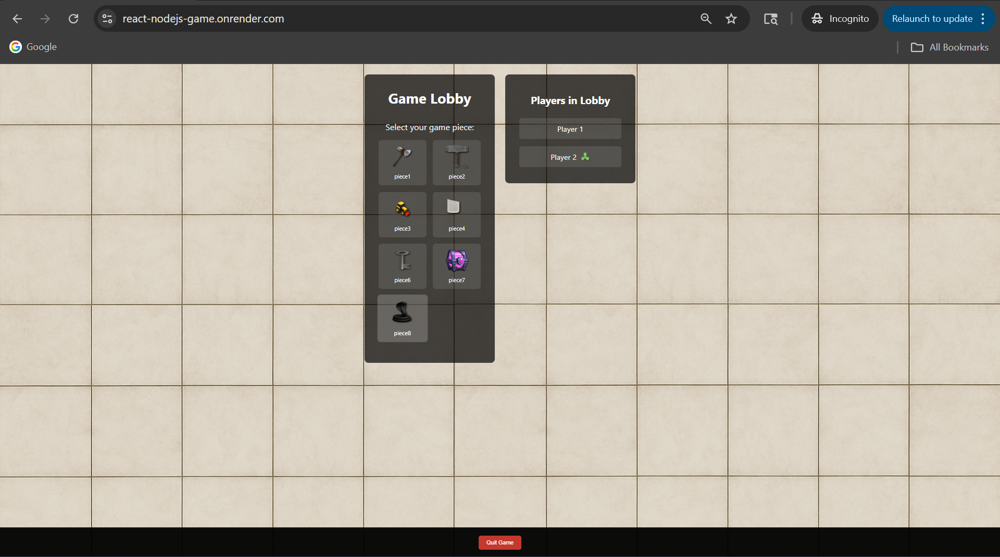
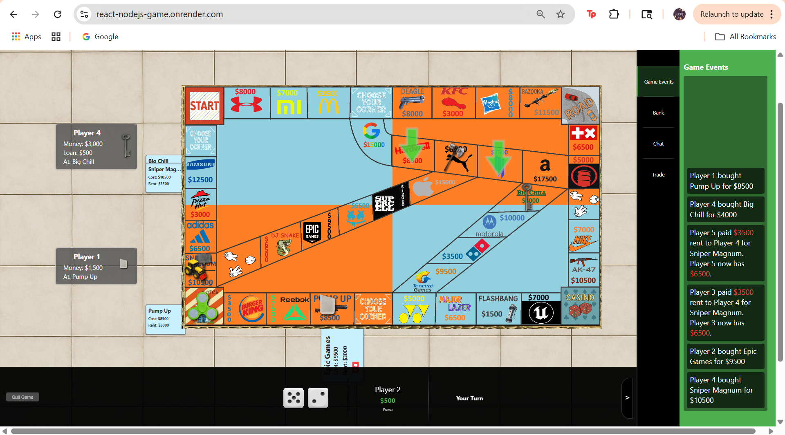
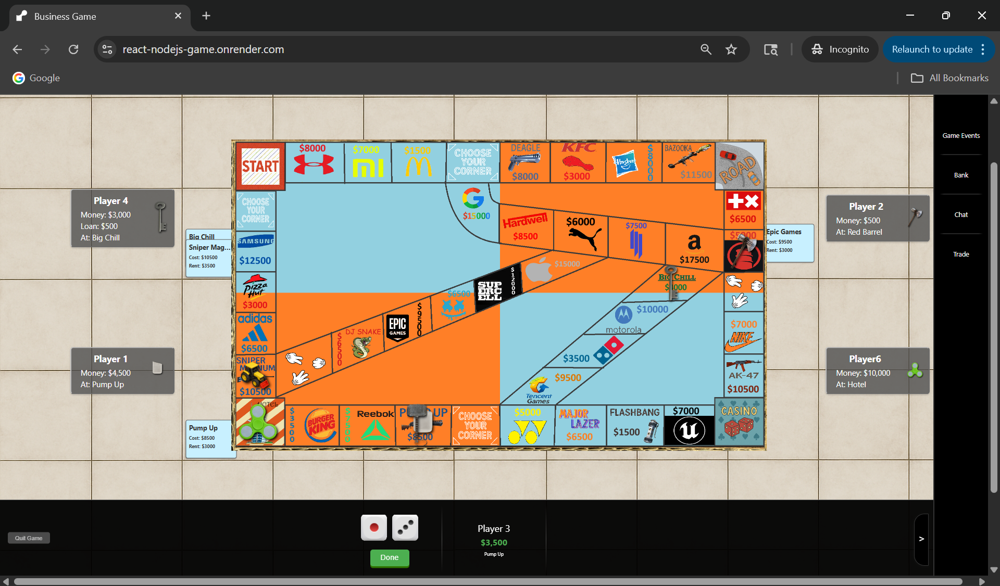
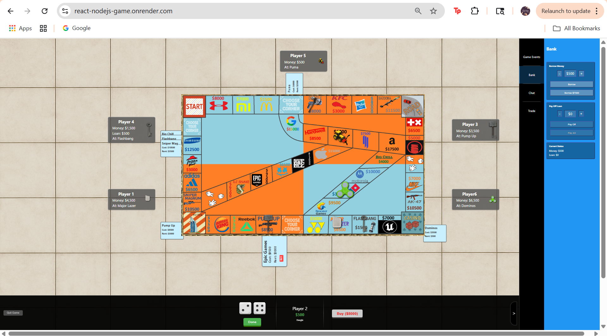

Liv# React + Node.js Multiplayer Game

A full-stack multiplayer board game built with React and Node.js, featuring real-time gameplay, persistent sessions, and a modern web UI.  
**Play now:** [https://react-nodejs-game.onrender.com/](https://react-nodejs-game.onrender.com/)

---

## Table of Contents

- [Overview](#overview)
- [Features](#features)
- [Technologies Used](#technologies-used)
- [How to Play](#how-to-play)
- [API Documentation](#api-documentation)
- [Screenshots](#screenshots)

---

## Overview

This project is a web-based multiplayer game inspired by an old board game. All players join a single, always-on lobby and play turns, trade, and interact in real time. The front-end is built with React, and the back-end uses Node.js, Express, Sequelize (AWS-hosted PostgreSQL), and Socket.io for real-time communication.

---

## Features

- **Real-time Multiplayer:** Play with friends in a single, persistent game lobby.
- **Persistent Player Data:** Player state is stored in an AWS-hosted PostgreSQL database.
- **Modern React UI:** Responsive and interactive interface using React hooks and context.
- **Chat and Trade:** In-game chat, player stats, and trading.
- **Redis Integration:** For health checks and potential caching.
- **REST API:** For player and session management.

---

## Technologies Used

- **Front-end:** React, socket.io-client, React Context, Hooks, CSS
- **Back-end:** Node.js, Express, Socket.io
- **Database:** PostgreSQL (via Sequelize ORM)
- **Cache/Health:** Redis
- **Job Queue:** Bull
- **Deployment:** Render.com

---

## How to Play

1. Go to [https://react-nodejs-game.onrender.com/](https://react-nodejs-game.onrender.com/)
2. Wait for other players to join the single game lobby (or join from another browser).
3. Play the game: roll dice, buy properties, trade, and chat in real time!

---

## API Documentation

### Player Endpoints

- `POST /api/players` — Create or update a player  
  **Body:** `{ socketId, name, piece, tileId, prevTile, money, properties, ready }`
- `GET /api/players` — List all players
- `GET /api/players/:id` — Get player by socket ID

## Screenshots

**Lobby Screen:**  

**Game Screen:**  

> Note: All players join the same lobby. Only one game session can run at a time due to deployment and database constraints.

---

## Development Setup

> Users do not need to install anything to play.  
> One player per browser is possible.
 